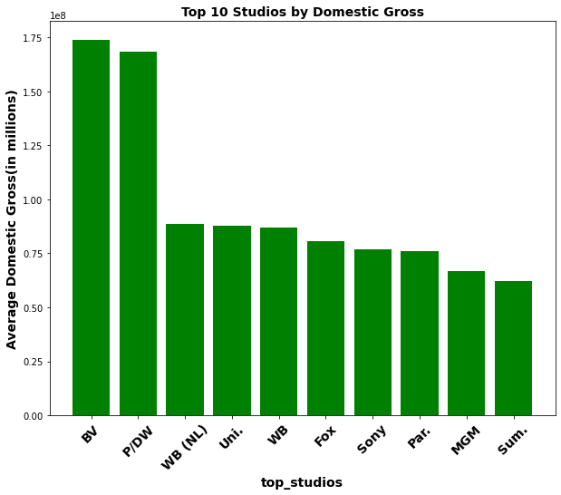

# Business overview
Microsoft has been in the tech industry for the longest time.However there has been an escalation in the movie industry which has captured the attention of microsoft.They have decided create a movie studio. The company lacks experience in making, recording and production of movies. In this report, we are going to analyse the provided datasets which are related to movie industry inorder to provide the necessary insights to microsoft for them to make the best decisions regarding the type of movies to produce,the time of the year when they should produce the movies also different trends that are in the movie industry. We are also going to use different visualisations in order to show different trends and also top performing movies in the industry.

---
# Business problem
Microsoft sees all the big companies creating original video content and they want to get in on the fun. They have decided to create a new movie studio, but they don’t know anything about creating movies. You are charged with exploring what types of films are currently doing the best at the box office. You must then translate those findings into actionable insights that the head of Microsoft's new movie studio can use to help decide what type of films to create.

---

# Data understanding
The data used was obtained from three renowned movie websites:
 1. Box Office Mojo (https://www.boxofficemojo.com/) - bom.movie_gross.csv

 2. IMDB (https://www.imdb.com/) - im.db

 3. The Numbers (https://www.the-numbers.com/)- tn.movie_budgets.csv

 -
 --
 * From the [first dataset](bom.movie_gross.csv) which is in `.csv` format, we have the title, studios, domestic gross revenue, foreign gross revenue and the year in which the movie was released. We will use data from the studio and domestic gross columns for the analysis .
 
 * From the [second dataset](im.db) which is in `.db` format, we have a database with 8 tables containing different types of non-monetary information about films such as their directors, writers, and genres, and the ratings and [more](images/imdb_data_erd.jpeg). We will use information from movie basics and movie ratings tables

 * From the [third dataset](data/tn.movie_budgets.csv.gz) which is in `.csv` format, we have the names, release dates, production budget, domestic gross revenue and worldwide gross revenue of films that have been released. Here, we use information from the production budget and worldwide gross columns. We calculate correlation of the two and further calculate return on investment using data from the two.

 ---

# Method used
This project used the following 
1.Jupyter notebook
2.seaborn
3.numpy
4.pandas
5.matplotlib
6.statistics

---
# Data visualisation

Recommendations
1.Microsoft should consider the type of movies they produce i.e the genres of the movies.From what we have seen that Action ,thriller genre has the top number of votes meaning that most people watch the movies.Microsoft should consider producing the movies that are in the genre that is most popular

2.microsoft should consider producing their movies in the months January and February since we can see that during the months of August, October and December its when most movies are produced. This is going to reduce the compettition since not most movies are released at the beggining of the year

3.Microsoft should consider collaborating with studios such as Buena vista(BV) since it seems to be producing the best movies.This will help the microsoft in production of the most popular movies and will have great retuns

4.While producing the movies, apart from the bud Microsoft should consider factors such as the runtime,time of release,how to penetrate the market when it comes to production of quality movies.